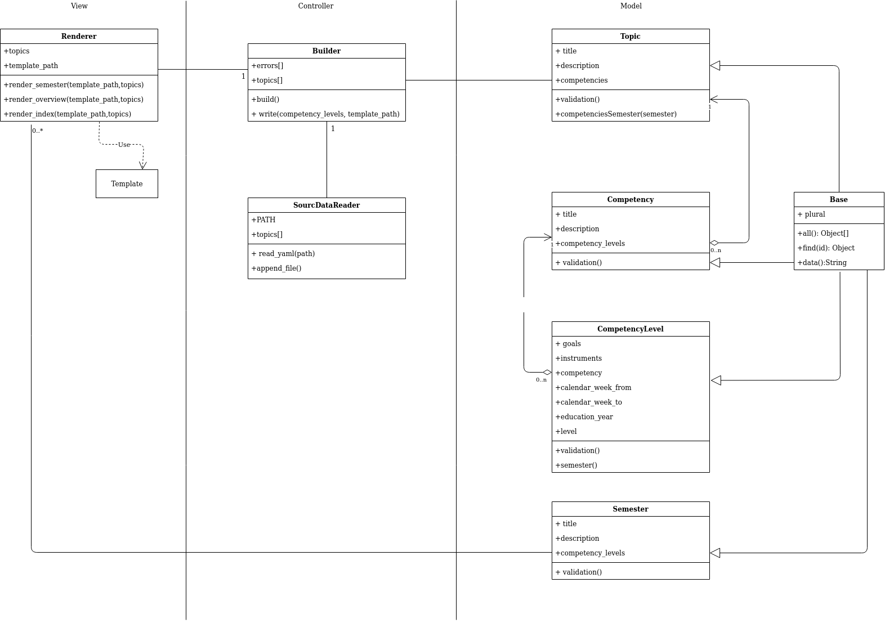

## Concept

### UML

### Error handling

Two kind of Errors can occur

1. Critical Errors
  * wrong file path
  * invalid Yaml

2. Non Critical Errors
   * wrong data

Critical errors lead to the abortion of the program. Detailed error messages will be displayed in the terminal.

Wrong data will be handled with validators.

### Validation

* relational integrity
* dates
  * no competence can extend the year
  * there are only four years

### Technologies

* Ruby 2.6
* Bundler
* Haml
* Rake
* Rspec

### Mockup

#### Overview

#### Semester

### Flowchart

